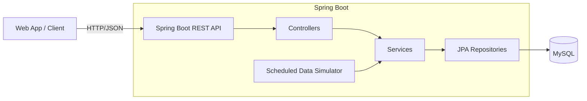
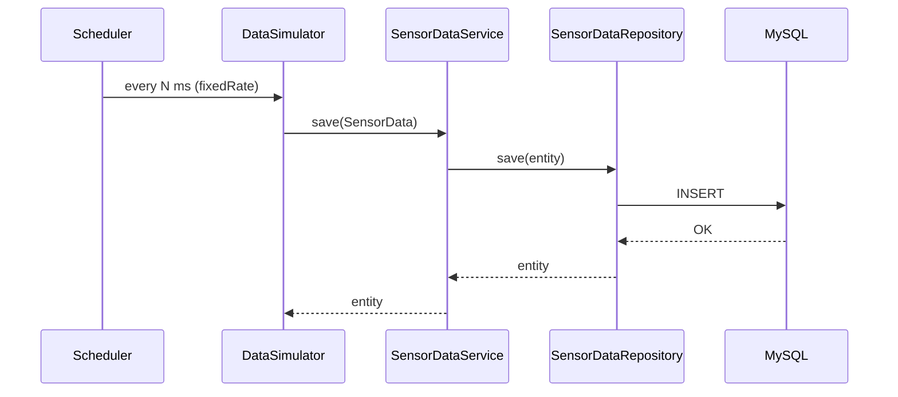
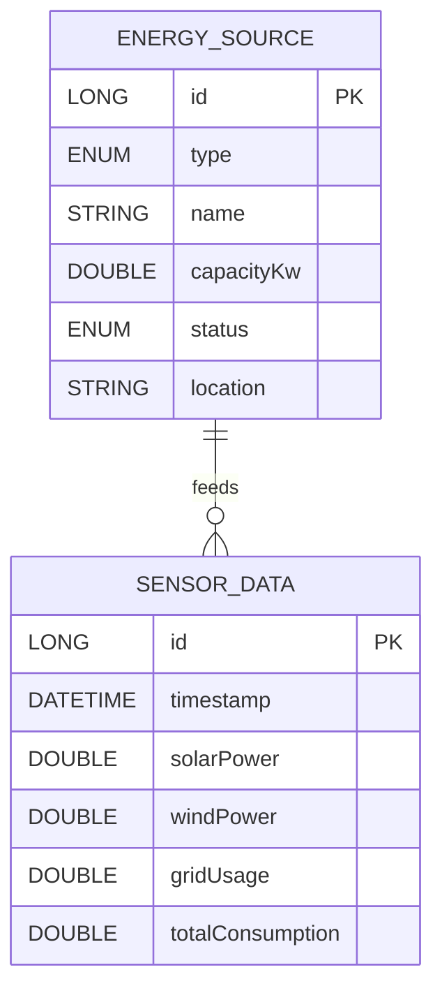

# SUEMS — Energy Monitoring & Simulation API

A Spring Boot 3 (Java 21) REST API for managing energy sources and streaming time‑series sensor data, with a built‑in scheduler that simulates realistic readings. Designed to be easy for beginners to run and useful for professionals to extend.

- Manage energy sources (CRUD)
- Query recent readings and time‑windowed data
- Summarize metrics (averages/totals fields present)
- Synthetic data simulator (toggleable)

## Quick Start

- Prerequisites
  - Java 21
  - Maven (wrapper included: `mvnw`/`mvnw.cmd`)
  - MySQL 8 running on `localhost:3306` with database `suems`

- Configure database (default creds in `src/main/resources/application.properties`)
  - Defaults: `spring.datasource.username=root`, `spring.datasource.password=1234`
  - Either change these to your local credentials, or create matching credentials.

- Create database (example)
  - SQL (as root):
    ```sql
    CREATE DATABASE suems;
    -- optional: create a dedicated user
    CREATE USER 'suems'@'localhost' IDENTIFIED BY 'suems';
    GRANT ALL PRIVILEGES ON suems.* TO 'suems'@'localhost';
    FLUSH PRIVILEGES;
    ```
  - Or via Docker:
    ```bash
    docker run --name suems-mysql -e MYSQL_ROOT_PASSWORD=1234 -e MYSQL_DATABASE=suems -p 3306:3306 -d mysql:8
    ```

- Run the app
  - Windows: `mvnw.cmd spring-boot:run`
  - macOS/Linux: `./mvnw spring-boot:run`
  - App starts on `http://localhost:8080`

- Verify
  - `curl http://localhost:8080/api/sensors/recent`

Notes
- JPA DDL auto‑creates/updates tables (`spring.jpa.hibernate.ddl-auto=update`).
- To disable the simulator, set `suems.simulator.enabled=false`.

## Architecture (At a Glance)







## REST API

Base URL: `http://localhost:8080`

Energy Sources

| Method | Path                 | Body               | Description |
|-------:|----------------------|--------------------|-------------|
| GET    | `/api/sources`       | —                  | List energy sources |
| POST   | `/api/sources`       | `EnergySourceDto`  | Create a source |
| POST   | `/api/sources/{id}`  | —                  | Get a source by id (note: POST used) |
| PUT    | `/api/sources/{id}`  | `EnergySourceDto`  | Update a source |
| DELETE | `/api/sources/{id}`  | —                  | Delete a source |

Sensor Data

| Method | Path                        | Query                     | Description |
|-------:|-----------------------------|---------------------------|-------------|
| GET    | `/api/sensors/recent`       | —                         | Most recent 100 readings |
| GET    | `/api/sensors/after`        | `ts=ISO-8601 datetime`    | Readings after timestamp (ascending) |
| GET    | `/api/sensors/summary`      | `hours=<int, default 24>` | Summary over the last N hours |

- Date format example for `ts`: `2025-01-31T12:30:00`

Example Payloads

EnergySourceDto
```json
{
  "type": "SOLAR",
  "name": "Rooftop Plant A",
  "capacityKw": 5000,
  "status": "ACTIVE",
  "location": "Building 1"
}
```

SensorDataDto (response)
```json
{
  "id": 123,
  "timestamp": "2025-10-17T10:03:21.123",
  "solarPower": 5.2,
  "windPower": 3.1,
  "gridUsage": 2.7,
  "totalConsumption": 9.8
}
```

SummaryDto (fields available)
```json
{
  "samples": 100,
  "avgSolar": 0.0,
  "avgWind": 0.0,
  "avgGrid": 0.0,
  "avgConsumption": 0.0,
  "totalSolar": 0.0,
  "totalWind": 0.0,
  "totalGrid": 0.0,
  "totalConsumption": 0.0
}
```
Note: average/total fields are present in the DTO. The service currently sets `samples` and reserves room for the aggregates.

## Data & Validation

EnergySource
- `type`: `SOLAR|WIND|GRID|BIOMASS`
- `name`: non‑blank
- `capacityKw`: ≥ 0
- `status`: `ACTIVE|INACTIVE|MAINTENANCE` (default `ACTIVE`)
- `location`: optional

SensorData
- Auto‑generated `timestamp` (server time)
- `solarPower`, `windPower`, `gridUsage`, `totalConsumption`: each ≥ 0

## Configuration

File: `src/main/resources/application.properties`

Key settings
- `server.port=8080` — HTTP port
- `spring.datasource.url=jdbc:mysql://localhost:3306/suems` — DB URL
- `spring.datasource.username=root` / `spring.datasource.password=1234` — credentials
- `spring.jpa.hibernate.ddl-auto=update` — schema evolution
- `suems.simulator.enabled=true` — toggle simulator
- `suems.simulator.interval-ms=10000` — generator interval (ms)

CORS
- Global config allows `http://localhost:3000` and common HTTP methods.
- Sensor endpoints explicitly allow any origin without credentials.

## Using the API (cURL)

- Create a source
  ```bash
  curl -X POST http://localhost:8080/api/sources \
    -H "Content-Type: application/json" \
    -d '{
      "type":"SOLAR","name":"Plant A","capacityKw":2000,
      "status":"ACTIVE","location":"Rooftop"
    }'
  ```

- List sources
  ```bash
  curl http://localhost:8080/api/sources
  ```

- Get source by id (note: POST)
  ```bash
  curl -X POST http://localhost:8080/api/sources/1
  ```

- Update source
  ```bash
  curl -X PUT http://localhost:8080/api/sources/1 \
    -H "Content-Type: application/json" \
    -d '{"capacityKw":2500}'
  ```

- Recent sensor data
  ```bash
  curl http://localhost:8080/api/sensors/recent
  ```

- Data after timestamp
  ```bash
  curl "http://localhost:8080/api/sensors/after?ts=2025-01-31T12:30:00"
  ```

- Summary (last 12 hours)
  ```bash
  curl "http://localhost:8080/api/sensors/summary?hours=12"
  ```

## Project Layout

```
src/
  main/
    java/com/suems/
      SuemsApplication.java                 # Spring Boot entrypoint (scheduling enabled)
      config/
        CorsConfig.java                     # Global CORS rules
        jacksonConfig.java                  # JavaTimeModule for LocalDateTime
      controller/
        EnergySourceController.java         # /api/sources endpoints
        SensorDataController.java           # /api/sensors endpoints
      dto/                                  # DTOs for API I/O
      exception/                            # Centralized API error handling
      mappers/                              # Entity <-> DTO mappers
      model/                                # JPA entities and enums
      repository/                           # Spring Data JPA repositories
      service/                              # Business services
      simulator/
        DataSimulator.java                  # Scheduled synthetic data generator
    resources/
      application.properties                # App config (DB, simulator, JPA)
      banner.txt                            # Startup banner
```

## Building, Packaging, Testing

- Run tests: `./mvnw test` (Windows: `mvnw.cmd test`)
- Package JAR: `./mvnw -DskipTests package`
- Run JAR: `java -jar target/suems-0.0.1-SNAPSHOT.jar`

## Error Format

On errors, the API returns a consistent shape with a timestamp:
```json
{
  "status": 404,
  "error": "Not Found",
  "message": "Energy Source id = 999 not found!",
  "path": "/api/sources/999",
  "timestamp": "2025-10-17T10:05:00.000"
}
```

## Tips & Troubleshooting

- MySQL connection refused
  - Ensure MySQL is running, the `suems` DB exists, and credentials match the properties file.
  - Try `mysql -h 127.0.0.1 -P 3306 -u root -p` to verify access.
- Schema not created
  - Keep `spring.jpa.hibernate.ddl-auto=update` (default). The app will create tables on first run.
- No sensor data appearing
  - Check `suems.simulator.enabled=true`. Logs will show scheduled inserts.
- CORS blocked in browser
  - Default allows `http://localhost:3000`. Adjust `CorsConfig` if your frontend runs elsewhere.

## Where to Look in Code

- Controllers: request mappings and shapes
  - `src/main/java/com/suems/controller/EnergySourceController.java`
  - `src/main/java/com/suems/controller/SensorDataController.java`
- Services: business logic and summaries
  - `src/main/java/com/suems/service/SensorDataService.java`
- Simulator: synthetic data inputs
  - `src/main/java/com/suems/simulator/DataSimulator.java`

---

Happy building! If you want, we can add a Postman collection, Docker Compose for MySQL+App, or a profile for H2 in-memory dev.
#
